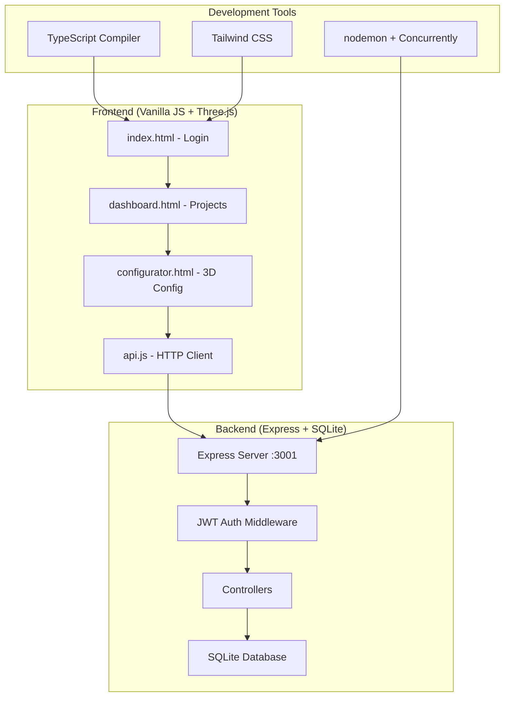
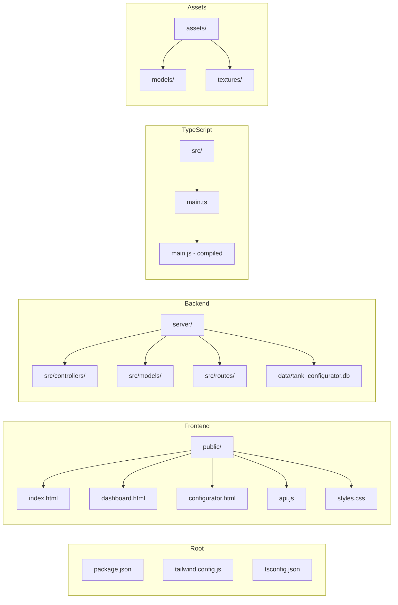
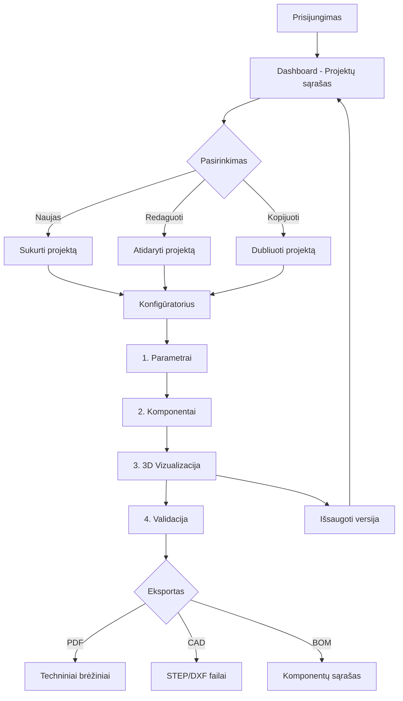
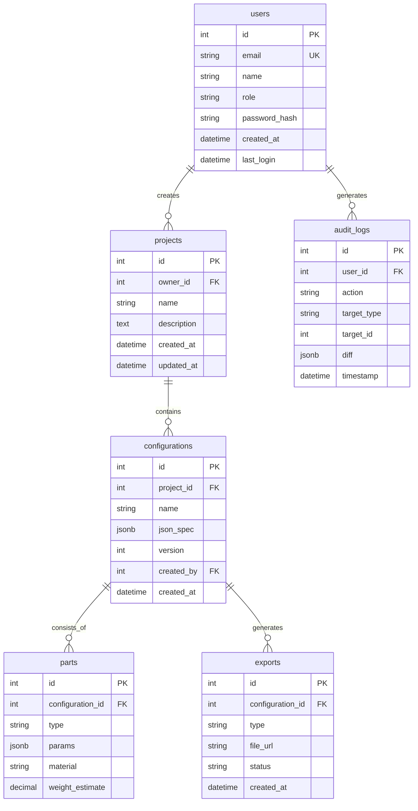
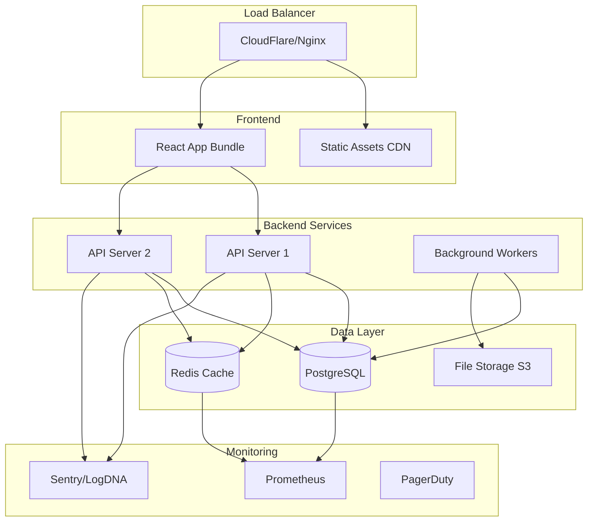

# 3D Talpų Konfigūratorius

Profesionalus, minimalistinis, vizualiai patrauklus 3D talpų (tankų) konfigūratorius skirtas gamintojams (pvz., Astra.lt). Projekto tikslas — leisti pardavėjams / inžinieriams greitai konfigūruoti metalines talpas, vizualizuoti jas 3D, gauti techninius brėžinius ir paruoštus komponentų sąrašus.

## 🏗️ Sistemos architektūra



## 🚀 Greitas startas

### 1. Diegimas
```bash
npm run install:all
```

### 2. Development režimas (viena komanda - paleidžia viską!)
```bash
npm run dev
```

Ši komanda automatiškai:
- ✅ Paleis backend serverį (http://localhost:3001)
- ✅ Paleis frontend serverį (http://localhost:3000)  
- ✅ Įjungs CSS build režimą (Tailwind watch)
- ✅ Sukurs SQLite duomenų bazę ir lenteles

### 3. Atidarykite naršyklėje
http://localhost:3000

## 📁 Projekto struktūra



## 🎯 Funkcionalumai

### Būtini (MVP) ✅
- [x] **Autentifikacija**: Registracija, prisijungimas, role-based access
- [x] **Projektų valdymas**: Kūrimas, redagavimas, šalinimas, dubliavimas
- [x] **Talpos konfigūravimas**: Tipas, tūris, aukštis/diametras, medžiaga
- [x] **Real-time 3D preview**: Interaktyvus 3D vaizdas su Three.js
- [x] **Išsaugojimas**: Konfigūracijų versijų valdymas
- [ ] **Eksportas**: PDF, SVG, CSV, STEP, DXF/DWG
- [ ] **Techniniai brėžiniai**: Automatinis 2D generavimas iš 3D

### Papildomi (vėlesnei iteracijai) 🔄
- [ ] **Dalijimasis**: Public/private nuorodos klientams
- [ ] **Kainos skaičiavimai**: Automatiniai skaičiavimai pagal medžiagas
- [ ] **ERP integracija**: Gamybos planavimo API
- [ ] **Multi-language**: LT/EN palaikymas
- [ ] **CAD redagavimas**: Web-based CAD editorius

## 🎨 UI ir dizaino gairės

### DaisyUI + Tailwind CSS
- **Spalvų paletė**: Neutralūs tonai + akcento spalva `#0ea5a4`
- **Tipografija**: H1 (28-32px), H2 (20-24px), body (14-16px)
- **Komponentai**: Navbar, Sidebar, Forms, Cards, Modals, Tables
- **Accessibility**: WCAG AA standartai, keyboard navigation

### User Flow



## 🛠️ Technologijų stack

### Frontend (Current)
- **Base**: HTML5, Vanilla JavaScript, CSS3
- **3D**: Three.js
- **Styling**: Tailwind CSS + DaisyUI
- **Build**: TypeScript, npm scripts

### Backend
- **Runtime**: Node.js + TypeScript  
- **Framework**: Express.js
- **Database**: SQLite (su migracija į PostgreSQL)
- **Auth**: JWT + bcrypt
- **File Storage**: Lokalus (planas: S3-compatible)

### Recommended Migration Path
```typescript
// Frontend: React + Vite migration
Frontend: HTML/JS → React + Vite + TypeScript
State: Zustand / React Query
Forms: React Hook Form + Zod
3D: react-three-fiber + drei

// Backend: Enhanced architecture  
Framework: Express → NestJS (arba išlaikyti Express + tsyringe)
ORM: SQL queries → Prisma
Database: SQLite → PostgreSQL
Queue: RabbitMQ/BullMQ (Redis) - eksportams
```

## 📊 Duomenų modelis



### Konfigūracijos Schema
```typescript
interface TankConfiguration {
  general: {
    type: 'vertical' | 'horizontal' | 'spherical';
    volume: number;
    tolerance_class: string;
  };
  dimensions: {
    height: number;
    diameter: number;
    wall_thickness: number;
    head_type: 'ellipsoidal' | 'dish';
  };
  materials: {
    shell: 'S235' | 'S355' | 'S316L';
    coating: 'paint' | 'galvanize' | 'none';
  };
  attachments: Array<{
    type: 'nozzle' | 'manway' | 'drain';
    size: string;
    position: { angle: number; height: number };
  }>;
  supports: Array<{
    type: 'saddle' | 'leg' | 'skirt';
    position: { x: number; y: number; z: number };
  }>;
  standards: {
    pressure_rating: number;
    design_code: 'EN13445' | 'AD2000' | 'ASME';
    safety_factor: number;
  };
}
```

## 🔌 API Endpoints

### Autentifikacija
```http
POST /api/auth/register     # Registracija
POST /api/auth/login        # Prisijungimas  
GET  /api/auth/me          # Vartotojo duomenys
POST /api/auth/logout      # Atsijungimas
```

### Projektai
```http
GET    /api/projects                    # Projektų sąrašas
POST   /api/projects                    # Naujas projektas
GET    /api/projects/:id                # Projekto duomenys
PUT    /api/projects/:id                # Projekto atnaujinimas
DELETE /api/projects/:id                # Projekto šalinimas
POST   /api/projects/:id/duplicate      # Projekto dubliavimas
```

### Konfigūracijos (Planned)
```http
GET  /api/projects/:id/configs          # Konfigūracijos
POST /api/projects/:id/configs          # Nauja konfigūracija
GET  /api/configs/:configId             # Konfigūracijos duomenys
PUT  /api/configs/:configId             # Atnaujinimas
POST /api/configs/:configId/validate    # Validacija
POST /api/configs/:configId/export      # Eksportas
```

## 🎮 3D Vizualizacija ir eksportas

### Current Implementation
- **Engine**: Three.js su parametriniais 3D modeliais
- **Features**: Real-time preview, camera controls, lighting
- **Performance**: LOD (Level-of-Detail), lazy loading

### Planned Exports
```typescript
// 3D formatai
STEP (.step/.stp)  - CAD standartas
STL              - 3D spausdinimui  
GLTF/GLB        - Web preview

// 2D formatai  
SVG             - Vektoriniai brėžiniai
PDF             - Techniniai brėžiniai
DXF/DWG         - AutoCAD

// Duomenų eksportai
CSV/Excel       - BOM (Bill of Materials)
JSON            - Konfigūracijos backup
```

### Technical Drawing Requirements
- **Views**: Front, side, top, isometric
- **Annotations**: Dimensions, tolerances, materials
- **Standards**: EN, ISO, ASME compliance
- **Templates**: Customizable title blocks

## ✅ Validacija ir standartai

### Rinkos reikalavimai
```typescript
// Validation Rules Engine
const validationRules = {
  materials: {
    'S235': { maxThickness: 50, minThickness: 3 },
    'S355': { maxThickness: 80, minThickness: 4 }
  },
  pressure: {
    'EN13445': (pressure, material, thickness) => boolean,
    'ASME': (pressure, material, thickness) => boolean
  },
  manufacturing: {
    maxDiameter: 4000,  // transportavimo riba
    maxHeight: 12000,   // gamybos riba
    weldingLimits: true
  }
};
```

## 🧪 Testavimas ir kokybė

### Development Commands
```bash
# Visa aplinka
npm run dev                 # Viskas (frontend + backend + CSS)
npm run dev:frontend        # Tik frontend (localhost:3000)
npm run dev:backend         # Tik backend (localhost:3001)
npm run dev:css            # Tik CSS watch

# Produkcijai
npm run build              # Build viskas
npm run start              # Produkcinė versija
npm clean                  # Išvalymas
```

### Testing Strategy (Planned)
```bash
# Unit tests
npm run test               # Jest/Vitest tests
npm run test:coverage      # Coverage report (80%+ target)

# Integration tests  
npm run test:e2e          # Playwright E2E flows
npm run test:api          # API endpoint tests

# Quality
npm run lint              # ESLint + Prettier
npm run type-check        # TypeScript validation
```

### Code Quality Standards
- **Coverage**: Minimum 80% for business logic
- **Linting**: ESLint + Prettier + Husky pre-commit
- **Reviews**: At least 1 senior review + green CI
- **Commits**: Conventional commits (feat:, fix:, docs:)

## 🚢 Deployment ir Infrastructure

### Current Setup
- **Development**: Local SQLite + Node.js
- **Frontend**: Static HTTP server
- **Backend**: Express.js su nodemon

### Production Architecture



### Production Roadmap
```yaml
# Docker setup
services:
  frontend: nginx + static files
  backend: Node.js + Express  
  database: PostgreSQL
  redis: Session + queue storage
  workers: Background job processors

# Cloud deployment
Platform: AWS ECS / DigitalOcean / Kubernetes
CDN: CloudFlare (3D modeliams ir assets)
Storage: S3-compatible (eksportams)
Monitoring: Prometheus + Grafana, Sentry
```

## 🔐 Saugumas

### Current Security
- ✅ JWT autentifikacija
- ✅ bcrypt password hashing  
- ✅ Express security headers
- ✅ Rate limiting
- ✅ Input validation

### Production Security Checklist
- [ ] HTTPS everywhere
- [ ] Secrets management (Vault)
- [ ] File upload validation
- [ ] SQL injection prevention  
- [ ] XSS protection
- [ ] RBAC implementation
- [ ] Regular dependency scanning

## 🗺️ Roadmap

```mermaid
timeline
    title Projekto plėtros planas
    
    section Phase 1 : MVP
        Q3 2025 : Autentifikacija
               : Projektų valdymas
               : 3D konfigūratorius
               : SQLite backend
               
    section Phase 2 : Professional
        Q4 2025 : PostgreSQL migracija
               : CAD eksportai
               : BOM generavimas
               : Validation engine
               
    section Phase 3 : Enterprise  
        Q1 2026 : ERP integracija
               : Multi-tenant
               : Collaborative editing
               : Mobile responsive
               
    section Phase 4 : Advanced
        Q2 2026 : AI optimization
               : AR preview
               : IoT integration
               : Advanced analytics
```

### Phase 1: MVP (Current) 🏗️
- [x] Autentifikacija ir projektų valdymas
- [x] Bazinis 3D konfigūratorius  
- [x] SQLite duomenų bazė
- [ ] PDF/SVG eksportas
- [ ] Baziniai techniniai brėžiniai

### Phase 2: Professional Features 📊
- [ ] PostgreSQL migracija
- [ ] CAD eksportai (DXF/STEP)
- [ ] BOM generavimas
- [ ] Validation engine
- [ ] Background job processing

### Phase 3: Enterprise 🏢  
- [ ] ERP integracija
- [ ] Multi-tenant architecture
- [ ] Collaborative editing
- [ ] Advanced CAD features
- [ ] Mobile responsiveness

### Phase 4: Advanced 🚀
- [ ] AI-powered optimization
- [ ] Augmented reality preview
- [ ] IoT integration
- [ ] Advanced analytics

## 👥 Contribution Guidelines

### Copilot/AI Developer Behavior
Elgkitės kaip **senior developer**:

```typescript
// ✅ Good: Aiškus, testuojamas kodas
interface TankParams {
  diameter: number;
  height: number;
  wallThickness: number;
}

function validateTankDimensions(params: TankParams): ValidationResult {
  const errors: string[] = [];
  
  if (params.diameter < 500) {
    errors.push('Minimum diameter is 500mm');
  }
  
  return { isValid: errors.length === 0, errors };
}

// ✅ Su testais
describe('validateTankDimensions', () => {
  it('should reject diameter below 500mm', () => {
    const result = validateTankDimensions({ diameter: 300, height: 1000, wallThickness: 5 });
    expect(result.isValid).toBe(false);
    expect(result.errors).toContain('Minimum diameter is 500mm');
  });
});
```

### PR Requirements
- **Single responsibility**: Vienas funkcionalumas per PR
- **Tests included**: Unit + integration testai
- **Documentation**: README/API docs updated
- **Performance notes**: Jei paveiks našumą
- **Migration scripts**: Jei keičia DB struktūrą

## 📚 Dokumentacija

### `/docs/` struktūra (Planned)
```
docs/
├── api/              # OpenAPI/Swagger dokumentacija
├── design-system/    # Tailwind tokens, DaisyUI overrides  
├── 3d-models/       # 3D duomenų schemos
├── cad-templates/   # PDF/DWG šablonai
├── validation/      # Standartų taisyklės
└── deployment/      # Infrastructure docs
```

## 📞 Kontaktai ir palaikymas

- **Projekto savininkas**: [vardas] — email@example.com
- **Tech lead**: [vardas] — tech@example.com
- **Issues**: GitHub Issues tab
- **Diskusijos**: GitHub Discussions

## 📄 Licencija

MIT License - žr. LICENSE failą detalioms informacijoms.

---

**🎯 Tikslas**: Sukurti profesionalų, patikimą ir masiškai naudojamą talpų konfigūratorių, kuris atitinka pramonės standartus ir vartotojų poreikius.